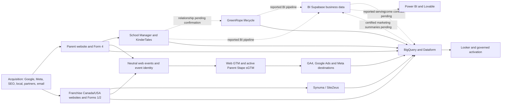

# CEFA Marketing Operations Context Layer

**Last updated:** 2026-08-08
**Owner:** CEFA marketing operations
**Status:** Canonical context entry point
**Review cadence:** Update on material change; verify quarterly

## Purpose

This document is the shortest reliable route into CEFA marketing operations.
It tells a new operator or agent:

- which business areas and systems exist;
- which system owns each type of truth;
- how the major systems connect;
- which identifiers and data grains must remain separate;
- what is verified, partial, pending, blocked, or only historical;
- where to find current integration details, open gaps, and failure responses;
- which actions require explicit approval.

This is a routing and context contract. It does not replace live read-back,
runtime code, the detailed handover, the program register, or narrow
implementation documents.

## Load Context In This Order

1. Read this context layer.
2. Read the
   [measurement platform handover](./measurement-platform-handover-2026-07-27.md).
3. Read the
   [program register](./measurement-and-activation-program-register-2026-07-23.md)
   for current status, blockers and next actions.
4. For Parent measurement, data, modeling or activation work, read the
   [Parent omnichannel measurement and intelligence roadmap](./parent-omnichannel-measurement-and-intelligence-roadmap-2026-08-08.md).
5. Read the
   [system and integration register](../70-growth-operations/system-and-integration-register.md)
   for source-to-destination boundaries.
6. Read the
   [gap, risk and scenario register](../70-growth-operations/gap-risk-and-scenario-register.md)
   before making a production change.
7. Open the narrow owning workstream document before implementation.
8. Verify live systems read-only immediately before any live write.

The machine-readable routing companion is
[`data/reference/marketing-operations-context.json`](../../data/reference/marketing-operations-context.json).

## Scope

The hub covers:

- parent enrollment marketing;
- Franchise Canada acquisition;
- Franchise USA acquisition;
- website forms, attribution and conversion tracking;
- Google Ads, Meta and supporting paid-media operations;
- GA4, GTM, production Parent Stape server-side tagging, and planned isolated
  franchise server-side tagging;
- BigQuery, Dataform, Cloud Run and reporting contracts;
- the BI-owned Python, Supabase, Power BI and Lovable business-reporting
  context and its planned marketing interfaces;
- SEO, local SEO, Search Console and DataForSEO;
- organic social, partner/merchant placements and campaign offers;
- creative asset sourcing, approvals and build handoffs;
- school, program, location, campaign and platform master data;
- KinderTales, GreenRope, Synuma/SiteZeus and Mailchimp touchpoints;
- CRM lifecycle and secondary offline-conversion activation;
- reusable measurement, conversation, capacity, action-to-outcome, model, and
  portable-interface contracts for future product readiness;
- naming conventions, UTMs, build control and guarded automation;
- public handover, decision history, gaps, risks and runbooks.

The hub does not contain raw customer data, credentials, private production
runtime, commercial product strategy, or authority to change spend and
production systems without approval. Reusable architecture does not make CEFA
row-level data, credentials, destinations, or private runtime available to a
future external product. See the
[reusable-contract extension](../20-bigquery/reusable-data-contracts-and-future-product-readiness-2026-08-06.md).

## Business Domains

| Domain | Primary business outcome | Operational truth | Marketing role |
|---|---|---|---|
| Parent enrollment | A parent inquiry reaches the intended school/admissions process | Gravity Forms Form 4 plus KinderTales delivery evidence | Acquire, attribute and improve qualified parent demand |
| Parent lifecycle | A prospective inquiry progresses through tours and CRM outcomes | Prospective GreenRope transition once exact Form 4 identity is available | Report downstream quality without replacing final enrollment truth |
| Franchise Canada | A franchise or site inquiry is saved and delivered | Gravity Forms Form 1/2 plus Synuma/SiteZeus delivery | Acquire and attribute Canadian franchise demand |
| Franchise USA | A franchise or site inquiry is saved and delivered | USA Gravity Forms Form 1/2 plus Synuma/SiteZeus delivery | Acquire and attribute US franchise demand |
| Paid media | Spend and traffic are delivered by the intended object and location | Google Ads/Meta object IDs, platform delivery and governed conversion mappings | Plan, launch, optimize and report acquisition |
| Organic and local | Searchers reach correct CEFA pages and school listings | Search Console, website, GBP/Yelp and canonical page/school mappings | Grow non-paid demand and local visibility |
| Marketing intelligence | Source evidence becomes reconciled decision-ready reporting | Certified BigQuery contracts with freshness and source labels | Explain performance and support activation |
| Campaign operations | Briefs, copy, creative, URLs, budgets and platform builds remain traceable | Governed naming/build contracts plus approved budget source | Reduce launch errors and preserve comparable reporting |
| Partnerships and content | Offers, partner links, organic content and creative remain attributable and approved | Partner/offer registry, content calendar and approved asset source once established | Grow incremental demand without creating untraceable traffic or asset drift |

## System Landscape

| Layer | Systems | Context rule |
|---|---|---|
| Websites | `cefa.ca`, `franchise.cefa.ca`, `franchisecefa.com` | Keep Parent, Franchise Canada and Franchise USA isolated |
| Form truth | Gravity Forms Form 4; franchise Forms 1 and 2 | Saved entries are lead evidence; platform conversions alone are not |
| Parent operations | CEFA School Manager, KinderTales | Own school/program/day behavior and parent business delivery |
| Parent CRM | GreenRope | Current-state opportunity and prospective lifecycle context; not final enrollment truth |
| Franchise CRM delivery | CEFA Franchise API, Synuma/SiteZeus | Delivery confirmation is required for franchise business truth |
| Website measurement | CEFA Conversion Tracking, WPCode bridge, GAConnector, GTM | Neutral events and identity; destination mapping remains property-specific |
| Analytics | GA4 properties and native BigQuery export | Web behavior and event evidence, not CRM truth |
| Advertising | Google Ads and Meta | Platform delivery, spend and optimization; IDs are stable object handles |
| Server tagging | Stape Business, direct Stape API, Stape MCP and GTM MCP | Parent web version `15` and server version `13` are production live through `edge.cefa.ca`; GA4, Meta CAPI, Google Conversion Linker and Google Ads Inquiry Submit share the Form 4 event identity. Operational destination monitoring remains guarded; franchise routes are separate and pending |
| Data platform | BigQuery, Dataform, Cloud Run, Scheduler, Tasks, Pub/Sub, Secret Manager | Reconcile and activate governed evidence; normal marts contain no raw PII. The committed Dataform cloud mirror passed `18/18` assertions while Cloud Run remains the production orchestrator |
| BI business-data layer | Reported BI Python pipeline, Supabase, Power BI, Lovable | Consolidated Parent business data and internal BI serving; a restricted zero-row BigQuery outcome inbox and v1 interface exist, while BI source schema, mappings and pipeline remain pending read-only verification |
| Reporting | BigQuery serving views, Looker Studio, Supermetrics, Power BI, Lovable | Show source, grain and freshness; do not silently substitute stale data |
| Email/journeys | Mailchimp and GreenRope email activity | Later omnichannel evidence; provider feeds and eligibility still need review |
| SEO/local | Search Console, DataForSEO, GBP, Yelp, WordPress | Organic/local evidence and URL governance |
| Planning/control | OneDrive/SharePoint budget workbook, v21 Google Sheet, n8n planning | Budget workbook is canonical; automation remains validation/export-first |
| Creative/content | SharePoint/Drive asset sources, partner placements and organic social | Current ownership and approval contracts are partial or pending |
| Source control | Public `cefa-marketing-ops` plus planned private runtime repo | Public context and safe code here; private deployable runtime elsewhere |

## End-To-End Flow

Dashed lines are not verified production contracts.

## Source-Of-Truth Routing

| Question | Primary source | Supporting evidence | Never use alone |
|---|---|---|---|
| Did a parent inquiry happen? | Saved Form 4 entry and KinderTales delivery status | `school_inquiry_submit`, GA4, Google, Meta, BigQuery | Platform conversion count |
| Which parent school was selected? | Form 4 `school_uuid` / Field `32.1` | School dimension and event payload | Campaign name, school label or slug |
| Did a parent enroll? | KinderTales/approved operational enrollment source | GreenRope CRM context and warehouse reconciliation | GreenRope `closed won` by itself |
| What is the consolidated Parent business-data layer? | BI Supabase, as reported internally | KinderTales/GreenRope source lineage and read-only schema/pipeline verification | An unverified table or dashboard total |
| Did a franchise inquiry happen? | Saved franchise form entry and Synuma/SiteZeus delivery | Neutral event, GA4, Google, Meta, BigQuery | Platform lead count |
| Which ad delivered traffic/spend? | Platform object ID and platform delivery | Click IDs, UTMs, naming keys and warehouse rows | Mutable display name |
| What was the approved budget? | OneDrive/SharePoint budget workbook | Governed read-only mirror | Current spend or platform daily budget |
| What happened on the website? | GA4 plus saved form/business evidence | Browser/server diagnostics | CRM aggregate alone |
| What is organic-search performance? | Search Console | GA4 landing behavior and DataForSEO research | Paid-platform data |
| What should a dashboard show? | Certified BigQuery serving contract | Freshness, reconciliation and rule registry | Unlabelled raw connector output |
| What may a future external product reuse? | Legally approved versioned schema and code patterns deployed in a separate environment | Synthetic fixtures and explicit legal/security review | CEFA rows, credentials, destinations, private runtime or an unrestricted CEFA benchmark |
| Which naming/copy rule applies? | Paid-media naming and copy standard | v21 build control and active-object inventory | Existing object name as precedent |

Detailed routing remains in
[data-taxonomy.md](./data-taxonomy.md) and
[source-of-truth-rules.md](./source-of-truth-rules.md).

## Identity And Grain Contract

Keep these grains separate:

| Grain | Canonical handle | Rule |
|---|---|---|
| Browser event | `cefa_event_id` / `event_id` | One confirmed event identity across browser/server copies |
| Form submission | Form entry ID | One saved submission; not the same as a person |
| Adult parent/contact | Restricted `parent_key` | Never expose raw contact data in normal marketing marts |
| Household | Restricted `household_key` when source-confirmed | Do not infer household by shared address or surname |
| Dependent/child | Restricted `dependent_key` when source-confirmed | Support multiple children; never use child name as a marketing key |
| Inquiry | `inquiry_key` | One parent may submit multiple legitimate inquiries |
| CRM opportunity | `opportunity_key` / provider opportunity ID | Multiple school opportunities may derive from one inquiry |
| School | `school_uuid` | Canonical parent-school join; labels and slugs are aliases |
| Program | `program_id` where available | Program labels and naming tokens are not operational IDs |
| Campaign object | Platform campaign/ad set/ad group/ad ID | Use IDs for live joins and changes |
| Reporting key | Governed campaign/ad/build key | Stable reporting and UTM alias, not a platform ID |

Do not deduplicate parents, children, inquiries or school interest by email
alone.

## Measurement And Activation Rules

- Keep website events neutral and map platform destinations in GTM/sGTM.
- Keep existing website inquiry conversions primary until a separate
  optimization decision is approved.
- Launch CRM-stage conversions as secondary/reporting-only.
- Use the same event ID for browser/server copies of one event.
- Never manufacture click IDs, Meta cookies, consent, timestamps or CRM
  identity.
- Quarantine records with missing or conflicting exact identity.
- Keep promoted school and selected school as separate dimensions.
- Keep platform conversions and business outcomes as separate metrics.
- Default new/imported campaign objects to paused unless activation is
  explicitly approved.
- Apply the CEFA Early Years visible-copy guardrail while allowing approved
  category-intent words in targeting.

## Status Vocabulary

| Label | Meaning |
|---|---|
| `Verified` | Confirmed by current live evidence, code, API, warehouse or cited source |
| `Active guarded` | Built or live under explicit safety gates |
| `Approved` | Direction approved; implementation may still be pending |
| `Partial` | Available but incomplete, stale, unreconciled or source-limited |
| `Pending` | Required work is known but incomplete |
| `Blocked` | A named dependency prevents the next gate |
| `Open question` | Requires owner, vendor or platform confirmation |
| `Reference only` | Historical/supporting context, not current authority |

Every factual status must include an evidence date or point to a dated owning
document.

## Current Blanks

These are intentional visible gaps, not facts to infer:

- the exact KinderTales-to-GreenRope contact/opportunity creation path;
- GreenRope opportunity fields for exact Form 4 event and entry identity;
- source-confirmed parent household/dependent identifiers;
- CEFA-controlled private runtime source repository;
- Parent Stape recovery custody and secondary administrator evidence, plus
  continuing Meta/Google destination diagnostics and rollback ownership;
- Parent paid-evidence contract v2 and correction of the current
  organic/referral-as-paid warehouse classification defect;
- explicit Parent complete-through, partial-day, freshness and
  source-to-serving reconciliation contracts;
- production Dataform Git/release/workflow configuration;
- complete franchise GAConnector replacement evidence;
- USA Synuma delivery gaps;
- current Parent Zoho/webhook feed ownership and purpose;
- Mailchimp Form 4 feed purpose, field minimization and eligibility;
- complete school/program/CRM/listing crosswalks;
- fresh paid connector detail after the dates in the paid-data availability
  report;
- fresh Search Console and DataForSEO evidence after the dates in the SEO
  handoff;
- a complete role-level RACI and recurring operating cadence.
- a central creative asset/approval/version register;
- a partner, merchant-page and offer registry;
- an organic social/content calendar and attribution contract;
- an agency/vendor access, ownership and escalation register;
- a campaign experiment and postmortem registry;
- a complete marketing KPI glossary covering business and platform metrics;
- verified BI Supabase record grain, exact identifiers, stage history, final
  enrollment lineage, original timestamps, freshness, corrections, and
  source-to-dashboard pipeline behavior;
- a versioned Supabase-to-BigQuery Parent outcome contract and
  BigQuery-to-Supabase/Power BI certified marketing-summary contract.
- trained-model evidence, out-of-time backtests and promotion gates for the
  current heuristic forecast, creative, lead-quality and MMM-readiness
  surfaces;

Do not fill a blank with a plausible story. Route it to the
[gap, risk and scenario register](../70-growth-operations/gap-risk-and-scenario-register.md).

## Decision Routing

| Decision | Owning workstream |
|---|---|
| Event, attribution, form identity or destination mapping | Conversion tracking |
| Warehouse model, data quality, activation ledger or serving contract | BigQuery/data |
| Production service, Stape, deployment, monitoring or rollback | Private Cloud/Stape runtime |
| Search, local visibility, page taxonomy or organic measurement | SEO |
| Campaign/ad/creative/UTM name or visible-copy rule | Naming convention |
| Budget, targeting, bidding, campaign activation or optimization | Paid media |
| School/program/location/CRM identity | Master data |
| Cross-channel process, dependency, incident or handover | Growth operations |

## Update Contract

When material context changes:

1. Update the narrow owning document.
2. Update the program register if status, owner, blocker, gate or sequence
   changed.
3. Update the integration register if a system connection changed.
4. Update the gap/scenario register if a gap opened, closed or changed
   severity.
5. Update the machine-readable context manifest.
6. Update this page only when the business map, authority, identity, activation
   rule or context-loading order changed.
7. Record the verification date and evidence type.

The context layer is correct only when live evidence, narrow contracts, this
summary and the machine-readable manifest agree.
