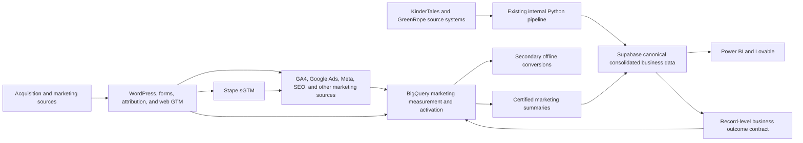

# CEFA Marketing Operations And BI Alignment - Independent Review Brief

**Date:** 2026-07-27

**Status:** Review completed; final CEFA decision is recorded in the
[alignment decision](./marketing-bi-alignment-final-decision-and-email-2026-07-27.md);
Supabase details still require read-only schema verification

**Owner:** CEFA marketing operations

**Audience:** Independent data, measurement, martech, and architecture reviewer

**Repository:** [CEFA Marketing Operations Hub](https://github.com/mert-atalay/cefa-marketing-ops)

**Review mode:** Read-only analysis; do not change production systems, data,
campaigns, conversions, forms, CRM records, pipelines, or permissions

## Purpose

Use this brief to evaluate CEFA's complete marketing measurement and
intelligence program against its current operating reality, not against an
idealized greenfield architecture.

The reviewer must answer two primary questions:

1. **Is the current CEFA marketing operations program structurally sound?**
   Grade the combined conversion tracking, first-party attribution, Stape
   server-side tagging, BigQuery/Dataform platform, CRM offline conversions,
   identity model, reporting, monitoring, and activation roadmap.
2. **How should the established Supabase business warehouse connect to the
   marketing platform?** Assess the newly reported GreenRope/KinderTales,
   Python, Supabase, Power BI, and Lovable architecture; evaluate the internal
   stakeholders' suggestions; and recommend a durable Supabase-to-BigQuery
   boundary that preserves actual business outcomes without delaying or
   weakening offline-conversion reporting.

The reviewer should also produce a beginner-friendly explanation that CEFA
marketing can use in its alignment meeting with the BI and digital
transformation teams.

## Required Reviewer Output

Return a decision-ready review with these sections:

1. **Overall grade:** Score the current program from `0-10` and explain the
   score in plain language.
2. **Scorecard:** Score tracking truth, attribution, identity, Stape/sGTM,
   BigQuery architecture, Supabase boundary, offline conversions, privacy,
   monitoring, ownership, and long-term maintainability.
3. **Top strengths:** Identify the five strongest parts of the current design.
4. **Top risks:** Identify the five most material weaknesses or failure modes.
5. **Architecture verdict:** State what should remain, change, stop, or wait.
6. **Supabase verdict:** State exactly which data BigQuery should receive from
   Supabase, which data BigQuery should obtain directly, and which data should
   never be duplicated.
7. **Offline-conversion verdict:** Confirm whether the proposed outcome path is
   timely, deterministic, deduplicated, and grounded in actual business
   reality.
8. **Inspection request:** List the tables, fields, relationships, pipeline
   behavior, timestamps, and SLAs that must be verified in Supabase.
9. **Meeting explanation:** Provide a 30-second and a two-minute explanation
   for non-technical stakeholders.
10. **Next actions:** Recommend the next five actions in priority order,
    separating actions CEFA marketing can complete independently from actions
    requiring BI, CRM, KinderTales, GreenRope, DNS, or IT support.

Label every conclusion as one of:

- `Verified from repository`
- `Reported internally; verification pending`
- `Reviewer inference`
- `Recommendation`

Do not silently promote reported Supabase behavior to verified production
truth.

## Executive Situation

CEFA is building a coordinated marketing operations platform that connects:

```text
Marketing source
  -> website visit and attributed inquiry
  -> CRM lifecycle outcome
  -> operational enrollment outcome
  -> reconciled reporting
  -> approved Google and Meta feedback
```

The project is broader than a dashboard. It is intended to provide:

- trustworthy inquiry and conversion counts;
- event-level attribution and deduplication;
- school, program, campaign, and source reconciliation;
- first-party browser and server-side tracking;
- CRM and enrollment outcome visibility;
- secondary offline conversions for Google and Meta;
- certified reporting contracts;
- later omnichannel journey, audience, forecasting, and predictive work;
- reproducible deployment, monitoring, incident response, and handover.

The current question is not whether Supabase or BigQuery is technically
capable of storing data. The question is how to preserve one canonical
business-data layer while retaining a purpose-built marketing measurement and
activation layer without building competing pipelines.

## Canonical CEFA Boundaries

These decisions are currently locked unless CEFA explicitly replaces them:

| Question | Current authority |
|---|---|
| Did a parent inquiry happen? | Saved Gravity Forms Form 4 entry plus KinderTales delivery evidence |
| Which school did the parent select? | Form 4 `school_uuid` / Field `32.1` |
| What identifies the website event? | `cefa_event_id` / Form 4 Field `32.4` |
| What identifies the saved submission? | Gravity Forms entry ID |
| Did a CRM stage happen? | Source-confirmed prospective GreenRope lifecycle transition |
| Did final enrollment happen? | KinderTales or another explicitly approved operational enrollment source |
| What does BigQuery own? | Marketing evidence, reconciliation, semantic truth, intelligence, and activation contracts |
| What does BigQuery not own? | Operational CRM, complete customer profiles, KinderTales delivery, or final admissions operations |
| What do advertising platforms own? | Platform delivery, spend, object IDs, and platform-reported attribution |
| Are platform conversion totals business truth? | No |

Parent, Franchise Canada, and Franchise USA remain isolated by website, form,
event taxonomy, GA4 property, Google destination, Meta dataset, CRM path, and
testing evidence.

## What Marketing Operations Has Built Or Approved

### 1. Website conversion truth

- Parent inquiry truth starts with Gravity Forms Form 4.
- The CEFA Conversion Tracking plugin preserves stable event identity and
  emits `school_inquiry_submit` only after a confirmed saved submission.
- The plugin improves first-party attribution and Form 4 fields `35-46`
  without replacing School Manager or KinderTales.
- Franchise Canada and Franchise USA use separate forms, events, destinations,
  and CRM delivery evidence.
- Existing website inquiry/application conversions remain primary.
- CRM lifecycle events remain secondary and reporting-only unless CEFA later
  approves a bidding change.

### 2. First-party attribution

- The parent site captures first- and last-touch attribution, UTMs, valid
  platform click IDs, landing page, and referrer evidence.
- A guarded server-side attribution ledger exists.
- The franchise properties retain GAConnector as the production attribution
  owner while the CEFA canonical implementation remains in shadow.
- Missing UTMs are not automatically classified as direct when valid click,
  landing, referrer, or prior non-direct evidence exists.
- Promoted school and selected school remain different dimensions.

### 3. Stape server-side GTM

- Stape Business is approved and available.
- The intended design uses first-party endpoints and separate Parent,
  Franchise Canada, and Franchise USA routing.
- Web GTM remains the browser event layer.
- Stape is additive transport for GA4, Google Ads, Meta CAPI, and
  browser/server deduplication.
- Stape does not become the CRM, business-delivery system, or warehouse.
- Production domains, containers, DNS, shadow routing, parity, and rollback
  are not yet completed.

### 4. BigQuery and Google Cloud

- Existing project: `marketing-api-488017`.
- BigQuery already receives the native parent GA4 event export and contains
  marketing source, staging, core, mart, serving, governance, and restricted
  activation surfaces.
- Current registered capacity is approximately `6.198 GiB` of durable
  BigQuery storage, with ample approved budget and operational headroom.
- Google Ads, Meta, Supermetrics, website, franchise, SEO, local, budget, and
  other marketing inputs are at different verified or partial stages.
- Dataform has 15 assertion definitions that compile and passed manual proof
  runs. Production Git, runtime identity, release, workflow, and parallel
  promotion remain incomplete.
- Cloud Run, Scheduler, Secret Manager, restricted datasets, and activation
  components exist. Monitoring, dead-letter handling, runbooks, and private
  source control remain incomplete.
- BigQuery is not a second CRM. Normal marketing datasets must not contain raw
  parent or child PII.

### 5. Parent CRM offline conversions

The approved reporting stages are:

| Source outcome | Canonical event | Current destination role |
|---|---|---|
| Tour scheduled | `tour_scheduled` | Google/Meta secondary reporting |
| Post tour | `tour_completed_candidate` | Candidate secondary reporting |
| GreenRope enrollment/closed won | `crm_closed_won` | CRM outcome only, not final KinderTales enrollment truth |

Current implementation includes:

- a restricted identity and lifecycle dataset;
- a Form 4 identity capture job;
- a GreenRope identity binder;
- a lifecycle poller;
- an idempotent outbox and dispatcher;
- delivery diagnostics and kill switches;
- three secondary Google conversion actions;
- three Meta custom CRM event types tested through Test Events;
- a non-uploadable baseline of existing GreenRope current-state records;
- deterministic transaction IDs and duplicate protections.

Production dispatch remains disabled. The current blockers include:

- missing GreenRope opportunity field `cefa_event_id`;
- missing GreenRope opportunity field `cefa_form_entry_id`;
- no completed controlled Form 4-to-GreenRope identity read-back;
- unresolved per-record platform eligibility;
- no first legitimate Meta production event to register the reporting event
  types.

No current campaign bidding, website conversion, School Manager field, or
KinderTales delivery path should change as part of resolving these blockers.

### 6. Longer-term marketing intelligence

The approved horizon includes:

- deterministic adult, household, dependent, inquiry, opportunity, and school
  relationships;
- multi-child and repeat-inquiry preservation;
- read-only Mailchimp and GreenRope email/journey evidence;
- school and campaign quality reporting;
- offline outcome activation;
- audience and suppression planning after separate approval;
- forecasting, anomaly detection, and predictive recommendations;
- certified semantic views for dashboards and agents.

Raw names, contact information, addresses, exact child details, notes, and CRM
payloads do not belong in normal marketing datasets.

## Newly Reported BI And Supabase Context

The following information came from an internal alignment discussion and must
remain `Reported internally; verification pending` until the BI team provides
read-only schema and pipeline evidence:

- Supabase/PostgreSQL is already CEFA's consolidated internal business-data
  warehouse.
- An internal Python pipeline retrieves relevant KinderTales and GreenRope
  data, including GreenRope API data, and loads it into Supabase.
- Supabase powers existing Power BI and Lovable dashboards.
- The BI team reports that CRM-stage and enrollment-outcome models already
  exist in Supabase.
- The digital transformation team prefers not to maintain a duplicate
  operational database.
- The team asked whether BigQuery is necessary and whether daily processing
  can replace event-level storage.

This information is strategically important, but it does not yet prove:

- whether the models contain individual records or only aggregates;
- whether GreenRope stage history is append-only or only current state;
- whether original source timestamps are preserved;
- whether final enrollment is directly sourced from KinderTales;
- whether `cefa_event_id` or the Gravity Forms entry ID is present;
- whether custom GreenRope opportunity fields automatically enter the Python
  pipeline;
- how one parent with multiple children, inquiries, schools, or opportunities
  is represented;
- how merges, corrections, deleted records, and late updates are handled;
- pipeline cadence, freshness SLOs, retry behavior, and monitoring;
- whether BI can expose a versioned, read-only, privacy-minimized outcome
  contract.

The current public repository does not yet register the Python-to-Supabase,
Power BI, or Lovable paths as verified integrations. Update the canonical
registers only after the meeting supplies sufficient evidence.

## Architecture Position To Review

The current recommended boundary is:



This is not literally one physical database. It is:

- one canonical consolidated **business-data warehouse** in Supabase; and
- one specialized **marketing measurement and activation warehouse** in
  BigQuery.

BigQuery must not duplicate the complete Supabase customer or operational
model. Supabase must not become the required route for every marketing event.

## Direct Versus Supabase-Sourced Data

The reviewer should challenge and refine this proposed ownership matrix:

| Data | Proposed path | Reason |
|---|---|---|
| GA4 raw website events | GA4 -> BigQuery directly | Native event export and attribution analysis |
| Google Ads and Meta delivery/spend/object data | Platform/connectors -> BigQuery directly | Platform IDs and source-faithful marketing evidence |
| Stape request and destination diagnostics | Stape/Cloud -> governed marketing diagnostics | Server transport QA and deduplication |
| Form 4 event identity and attribution | WordPress/Gravity Forms -> restricted/canonical marketing path | Do not delay website truth behind BI refresh |
| SEO, local, partner, creative, budget, and campaign operations data | Approved source -> BigQuery directly | Marketing-domain evidence |
| GreenRope CRM lifecycle outcomes | Supabase -> BigQuery if the contract passes | Reuse CEFA's consolidated business pipeline |
| KinderTales final enrollment outcomes | Supabase -> BigQuery if source lineage is verified | Preserve the approved operational business truth |
| Complete parent, child, CRM, admissions, and note records | Remain in operational systems/Supabase | BigQuery is not a second CRM |
| Certified campaign/day/school marketing facts | BigQuery -> Supabase or Power BI | Consolidated business reporting without raw marketing-event duplication |
| Direct GreenRope/KinderTales reads | Read-only parity, diagnosis, or bounded fallback | Verify Supabase completeness without creating a second production sender |

The recommended production activation source is one accepted outcome
contract, not two competing senders. A direct source poller may remain in
shadow during transition, but it must not independently upload the same
conversion.

## Minimum Supabase-To-BigQuery Outcome Contract

Supabase should provide only the record-level outcomes required to connect
business reality to marketing evidence.

### Required identity and source fields

- `cefa_event_id`
- `cefa_form_entry_id`
- stable GreenRope `opportunity_id`
- stable GreenRope `contact_id`, restricted where required
- stable KinderTales inquiry/enrollment ID where available
- `school_uuid`
- source program ID where available
- source system and source record ID
- schema version

### Required event fields

- canonical outcome type;
- original source stage/event ID and label;
- original `event_occurred_at`;
- source `updated_at`;
- Supabase `observed_at`;
- event status;
- correction, merge, or deletion/tombstone state;
- source timestamp quality;
- record-level eligibility or reason for quarantine where approved.

### Required behavior

- Preserve individual events rather than only aggregate totals.
- Preserve historical transitions rather than only the current stage.
- Preserve the original business timestamp instead of replacing it with the
  Supabase or BigQuery load time.
- Expose an incremental cursor or reliable `updated_since` contract.
- Make retries idempotent.
- Preserve legitimate multiple children, inquiries, schools, and
  opportunities.
- Distinguish GreenRope `crm_closed_won` from final KinderTales enrollment.
- Provide row counts, freshness, duplicate, and source-reconciliation checks.
- Avoid raw parent and child PII in the normal BigQuery feed.

### Proposed freshness targets for review

- CRM lifecycle outcomes: target delivery to BigQuery within `15-60 minutes`
  where the current pipeline supports it.
- Final operational enrollment outcomes: same day, with the original source
  timestamp preserved.
- Certified aggregate reporting: daily is normally sufficient.
- Source-to-Supabase-to-BigQuery reconciliation: daily.

The reviewer should recommend different targets if the source systems,
platform eligibility windows, operational workflow, or current pipeline make
these targets inappropriate.

## Why Event-Level Marketing Data Is Required

Data grain and processing frequency are different decisions.

CEFA can retain individual events while processing or summarizing them daily.
Aggregates such as "10 inquiries" or "4 enrollments" are useful for reporting,
but they cannot reliably:

- connect one outcome to the originating inquiry;
- connect that inquiry to a valid campaign, click ID, or source;
- prevent duplicate platform conversions;
- distinguish promoted school from selected or enrolled school;
- preserve multiple legitimate inquiries from the same parent;
- measure time between inquiry, tour, and enrollment;
- diagnose tracking inflation or missing conversions;
- construct an auditable Google or Meta offline-conversion event;
- reprocess corrected business outcomes safely.

CEFA does not need to copy every operational record into BigQuery. It does need
event-level marketing evidence and record-level business outcomes for the
events it intends to attribute, reconcile, or activate.

## Why BigQuery Remains A Separate Marketing Layer

Supabase/PostgreSQL can technically store event data and perform analytical
queries. The architectural question is not capability alone.

BigQuery is already the approved and partially operational marketing layer
because it provides or anchors:

- native GA4 raw-event export;
- Google Ads, Meta, Supermetrics, website, and other marketing-source landing;
- append-oriented marketing-event analysis;
- Dataform versioning, dependencies, assertions, and releases;
- governed source, core, mart, serving, and restricted activation layers;
- Cloud Run extraction, webhook, processing, and platform dispatch;
- platform delivery diagnostics, transaction IDs, and offline-conversion
  ledgers;
- marketing forecasting, anomaly detection, BigQuery ML, and agent-safe
  semantic views;
- workload separation from the operational business warehouse.

Moving all marketing work into Supabase would require CEFA to assess:

- rebuilding or relaying native and existing marketing exports;
- mixing operational business queries with high-volume marketing-event
  analysis;
- recreating Dataform, activation, diagnostics, and warehouse governance;
- duplicate transformations and conflicting metric definitions;
- additional operational load, tuning, retention, and ownership;
- migration risk to already functioning tracking and reporting surfaces.

The reviewer should identify any marketing workload that genuinely belongs in
Supabase, but should not recommend moving the entire approved marketing
platform merely to make the architecture appear to contain one physical
database.

## Offline-Conversion Reality Check

Supabase strengthens offline conversion reporting only if it supplies
source-faithful, event-level, timely outcomes.

The proposed safeguards are:

- Keep website inquiry conversions independent and primary.
- Add exact `cefa_event_id` and `cefa_form_entry_id` fields to the GreenRope
  opportunity.
- Confirm the existing GreenRope API pipeline retrieves both custom fields and
  stores them in Supabase.
- Require one business outcome to link to exactly one confirmed Form 4
  submission.
- Quarantine missing, conflicting, stale, or ambiguous records.
- Preserve source timestamps and store separate observation timestamps.
- Keep all pre-activation/current-state records non-uploadable.
- Deduplicate by the approved inquiry/event and canonical stage.
- Use one BigQuery activation ledger, outbox, dispatcher, accepted-ID lock,
  diagnostic surface, and kill switch.
- Keep direct source reads for parity and diagnosis, not parallel conversion
  uploads.
- Keep GreenRope closed-won separate from final KinderTales enrollment.
- Keep CRM conversions secondary until CEFA separately approves optimization.

### Decision conditions

| Supabase finding | Recommended decision |
|---|---|
| Individual outcomes, exact IDs, history, timestamps, and acceptable freshness exist | Use Supabase as the primary consolidated business-outcome feed |
| Only latest current state exists | Extend the BI pipeline with transition history or a governed event/outbox table before activation |
| Only aggregate totals exist | Use totals for reporting only; they cannot drive record-level offline conversions |
| CEFA IDs are absent | Complete the two GreenRope fields and pipeline mapping before production matching |
| Final enrollment is inferred only from GreenRope closed-won | Do not label it final enrollment; obtain KinderTales operational evidence |
| Pipeline is slow but source timestamps and IDs are complete | Preserve true event time, improve cadence, and keep replay/idempotency |
| Pipeline misses or overwrites records | Do not promote it; retain direct-source shadow and repair the business contract |

## Meeting Purpose

This meeting is not a debate over which database is more powerful. It is an
architecture and ownership alignment session.

Marketing operations should:

1. Explain the current conversion tracking, attribution, Stape, BigQuery,
   Dataform, and offline-conversion program.
2. Explain why BigQuery is a specialized marketing layer rather than a second
   operational CRM or customer database.
3. Explain why event grain is required even when reporting refreshes daily.
4. Show which marketing sources already enter BigQuery directly.
5. Define the minimum actual business outcomes needed from Supabase.

The BI team should:

1. Demonstrate the current KinderTales/GreenRope-to-Supabase pipeline.
2. Show the relevant table grain, primary keys, relationships, stage history,
   timestamps, and enrollment definition.
3. Confirm whether GreenRope custom opportunity fields flow through the API.
4. Explain refresh cadence, retry behavior, corrections, merges, deletions,
   monitoring, and ownership.
5. Identify the safest read-only view, API, outbox, webhook, or incremental
   interface for BigQuery.

The joint team should leave with:

- one source-owner matrix;
- one proposed outcome schema;
- one freshness and reconciliation SLA;
- one proof-of-concept record path;
- named technical and business owners;
- a decision on which current direct GreenRope components remain shadow,
  change source, or retire after parity;
- no production tracking, CRM, campaign, or enrollment-flow changes.

## Proposed Meeting Agenda

**Target duration:** 45-60 minutes

1. **Marketing project walkthrough - 15 minutes**
   - Current conversion truth and attribution.
   - BigQuery/Dataform and Stape direction.
   - Offline conversion and business outcome objective.
2. **BI architecture walkthrough - 15 minutes**
   - GreenRope/KinderTales API ingestion.
   - Supabase tables, relationships, history, and freshness.
   - Power BI and Lovable serving model.
3. **Identity and outcome mapping - 15 minutes**
   - `cefa_event_id`, Form entry ID, source IDs, school, program, stage, and
     enrollment evidence.
   - Multi-child, repeat-inquiry, and multi-school behavior.
4. **Boundary and proof of concept - 10 minutes**
   - Supabase-to-BigQuery outcome feed.
   - BigQuery-to-Supabase certified marketing summaries.
   - Monitoring, ownership, and parity.
5. **Decisions and next steps - 5 minutes**

## Beginner-Friendly Meeting Explanation

Use this as a starting point, then improve it based on the review:

> Supabase already brings together CEFA's business information, such as CRM
> progress and enrollment results. We are not trying to rebuild that database.
> BigQuery is the marketing workbench: it brings together website activity,
> advertising costs, campaigns, attribution, and tracking evidence. We need a
> small connection between them so BigQuery can learn which individual
> inquiries eventually became tours or enrollments, while Supabase and Power
> BI can receive clean marketing totals. Supabase tells us what happened in the
> business; BigQuery explains which marketing produced it and safely reports
> approved outcomes back to the advertising platforms.

## Questions The Independent Reviewer Must Challenge

1. Is the two-layer Supabase and BigQuery model the best long-term boundary for
   CEFA's actual scale and team?
2. Which approved BigQuery workloads would be weaker, more expensive, or more
   difficult to govern if moved into Supabase?
3. Which current BigQuery workloads are unnecessary duplication and should be
   simplified?
4. Should GreenRope CRM stages reach BigQuery from Supabase, directly from
   GreenRope, or through a controlled dual-path transition?
5. What is the safest path when Supabase is delayed or unavailable without
   creating duplicate platform conversions?
6. Is the proposed `15-60 minute` lifecycle target useful, or is another SLA
   more appropriate?
7. What evidence proves that Supabase contains actual business outcomes rather
   than reporting snapshots?
8. What evidence proves final enrollment independently from GreenRope
   closed-won?
9. Are `cefa_event_id` and `cefa_form_entry_id` sufficient for deterministic
   matching, or does the source contract require additional stable IDs?
10. Does the current identity design correctly preserve multiple parents,
    children, inquiries, schools, and opportunities?
11. Are the PII, HMAC, retention, click-ID, logging, and restricted-access
    boundaries appropriate?
12. Can the current offline conversion infrastructure be adapted to a
    Supabase outcome source without discarding its baseline, deduplication,
    diagnostics, or platform setup?
13. What should be shown in Power BI versus Looker/BigQuery serving surfaces?
14. How should CEFA prevent two teams from defining inquiry, tour, enrollment,
    attribution, and cost metrics differently?
15. What should CEFA explain to leadership in one minute about why both
    Supabase and BigQuery exist?

## Constraints For The Review

- Do not propose changing the current Form 4, School Manager, or KinderTales
  delivery path merely to simplify analytics.
- Do not make Stape or BigQuery part of the critical path for saving or
  delivering an inquiry.
- Do not combine Parent, Franchise Canada, and Franchise USA data or
  destinations without an approved semantic layer.
- Do not treat platform conversions as final business truth.
- Do not treat GreenRope closed-won as final enrollment without approved
  KinderTales evidence.
- Do not upload current-state or historical CRM records as new conversions.
- Do not promote CRM stages into bidding during this review.
- Do not copy full parent or child PII into normal BigQuery datasets.
- Do not deduplicate legitimate inquiries by email alone.
- Do not recommend a second production sender for the same offline conversion.
- Do not infer that an integration is live because an API, table, credential,
  or deployed service exists.
- Do not require marketing to wait for the Supabase alignment before
  continuing independent Stape, Dataform, monitoring, source-control, and
  direct marketing-ingestion work.

## Success Criteria For The Alignment

The architecture is acceptable when:

- Supabase remains CEFA's consolidated business-data layer without becoming a
  bottleneck for direct marketing collection.
- BigQuery retains the marketing event, attribution, intelligence, and
  activation workloads that are already approved and appropriate.
- Only minimum record-level business outcomes cross from Supabase to BigQuery.
- Certified marketing facts can flow back to Supabase or Power BI without
  conflicting definitions.
- Exact event and form identity connects one outcome to one confirmed inquiry.
- Stage history and final enrollment retain source lineage and timestamps.
- Delayed jobs can replay safely without duplicate platform conversions.
- Source totals, Supabase outcomes, BigQuery outcomes, and platform
  acceptances reconcile visibly.
- Existing website conversions, forms, KinderTales delivery, CRM operations,
  campaigns, budgets, and bidding remain unchanged.
- Every production path has an owner, freshness target, monitor, retry rule,
  dead-letter/recovery path, and rollback.

## Repository Reading Map

### Repository and directory entry points

- [Repository root](https://github.com/mert-atalay/cefa-marketing-ops)
- [Governance directory](https://github.com/mert-atalay/cefa-marketing-ops/tree/main/docs/00-governance)
- [Conversion tracking directory](https://github.com/mert-atalay/cefa-marketing-ops/tree/main/docs/10-conversion-tracking)
- [BigQuery and Google Cloud directory](https://github.com/mert-atalay/cefa-marketing-ops/tree/main/docs/20-bigquery)
- [Naming and UTM directory](https://github.com/mert-atalay/cefa-marketing-ops/tree/main/docs/40-naming-convention)
- [Paid media directory](https://github.com/mert-atalay/cefa-marketing-ops/tree/main/docs/50-paid-media)
- [Master data directory](https://github.com/mert-atalay/cefa-marketing-ops/tree/main/docs/60-master-data)
- [Growth operations directory](https://github.com/mert-atalay/cefa-marketing-ops/tree/main/docs/70-growth-operations)

### Read these first

1. [Marketing operations context layer](../00-governance/marketing-operations-context-layer.md)
2. [Measurement platform handover](../00-governance/measurement-platform-handover-2026-07-27.md)
3. [Measurement and activation program register](../00-governance/measurement-and-activation-program-register-2026-07-23.md)
4. [Source-of-truth rules](../00-governance/source-of-truth-rules.md)
5. [Data taxonomy](../00-governance/data-taxonomy.md)
6. [System and integration register](./system-and-integration-register.md)
7. [Gap, risk, and scenario register](./gap-risk-and-scenario-register.md)

### Architecture and implementation

- [Google Cloud and Stape measurement platform blueprint](../superpowers/plans/2026-07-25-google-cloud-stape-measurement-platform-blueprint.md)
- [Locked BigQuery marketing intelligence blueprint](../superpowers/plans/2026-06-12-bq-marketing-intelligence-blueprint.md)
- [Google Cloud and Stape capacity baseline](../20-bigquery/google-cloud-stape-capacity-baseline-2026-07-25.md)
- [Dataform source control and parity](../20-bigquery/dataform-source-control-and-parity-2026-07-25.md)
- [Parent CRM offline-conversion blueprint](../superpowers/plans/2026-07-23-parent-crm-offline-conversion-activation-blueprint.md)
- [Parent CRM offline-conversion data contract](../20-bigquery/parent-crm-offline-conversion-data-contract.md)
- [Parent CRM offline-conversion implementation report](../10-conversion-tracking/parent-crm-offline-conversion-implementation-report.md)
- [Full conversion-tracking assessment](../10-conversion-tracking/full-conversion-tracking-assessment-and-execution-plan-2026-07-09.md)

### Parent identity and business-delivery boundaries

- [Parent Form 4 and KinderTales boundary](../10-conversion-tracking/parent-form4-kindertales-attribution-boundary-2026-07-10.md)
- [Parent omnichannel vendor API request](../10-conversion-tracking/parent-omnichannel-vendor-api-request-2026-07-25.md)
- [Parent Form 4 omnichannel WordPress handoff](../10-conversion-tracking/parent-form4-omnichannel-wordpress-handoff-plan-2026-07-25.md)
- [KinderTales and GreenRope identity/webhook request](../10-conversion-tracking/kindertales-greenrope-identity-webhook-email-2026-07-25.md)
- [Live WordPress tracking inventory](../10-conversion-tracking/live-wordpress-tracking-plugin-inventory-2026-07-27.md)

### Adjacent current work

- [Franchise GAConnector shadow rollout](../10-conversion-tracking/franchise-gaconnector-shadow-rollout-2026-07-20.md)
- [Paid-media naming and copy standard](../40-naming-convention/cefa-paid-media-naming-and-copy-standard.md)
- [Master-data taxonomy and measurement reference](../60-master-data/cefa-master-data-taxonomy-and-measurement-reference-2026-05-03.md)

## How To Use This Review

Treat the review as advice, not production authorization.

After the BI meeting:

1. Verify the Supabase schema and pipeline read-only.
2. Update the narrow Supabase/BI integration contract.
3. Update the system and integration register.
4. Update the program register if the GreenRope source path or blocker changes.
5. Update the data taxonomy and source-of-truth rules if authority changes.
6. Update the gap/scenario register.
7. Update the machine-readable marketing-operations context.
8. Preserve the existing website, CRM, conversion, and activation safety gates.

## Review Record

| Field | Value |
|---|---|
| Reviewer | Independent architecture review, reconciled by CEFA marketing operations |
| Review date | 2026-07-27 |
| Overall grade | `7/10`; reviewer estimate, not a measured completion percentage |
| Architecture decision | Accepted with parallel execution, independent activation gates, consent-capable Stape, and controlled Supabase cutover |
| Supabase evidence reviewed | Pending |
| Required follow-up | Read-only Supabase inspection, shared metric dictionary, proof-of-concept record, and named interface owners |
| CEFA decision owner | Mert Atalay / CEFA marketing operations |

The send-ready meeting position and implementation consequences are in the
[final alignment decision](./marketing-bi-alignment-final-decision-and-email-2026-07-27.md).
