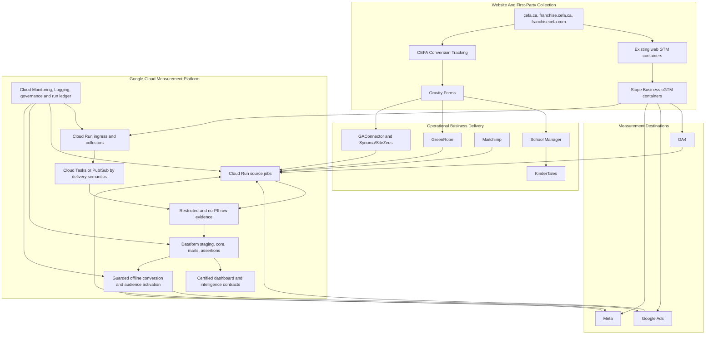

# CEFA Google Cloud And Stape Measurement Platform Blueprint

**Plan date:** 2026-07-25
**Status:** Definitive implementation blueprint
**Google Cloud project:** `marketing-api-488017`
**Scope:** Parent, Franchise Canada, Franchise USA, website measurement,
marketing intelligence, CRM outcome activation, email/lifecycle engagement,
and approved audience use
**Strategic anchor:** [CEFA BigQuery Marketing Intelligence Blueprint](./2026-06-12-bq-marketing-intelligence-blueprint.md)
**Program control:** [CEFA Measurement And Activation Program Register](../../00-governance/measurement-and-activation-program-register-2026-07-23.md)

## 1. Executive Decision

CEFA will build one coordinated measurement and activation platform using:

- Stape Business and server-side Google Tag Manager for resilient first-party
  website measurement and server delivery;
- the existing Google Cloud project for durable ingestion, BigQuery truth,
  transformation, reconciliation, CRM outcome activation, monitoring,
  predictive analysis, and controlled audience delivery;
- existing browser GTM containers for browser interaction capture;
- existing Gravity Forms, School Manager, KinderTales, GreenRope,
  Mailchimp, GAConnector, and Synuma/SiteZeus paths within their documented
  ownership boundaries.

The platform is not restricted to Google Cloud free tiers. Technical fit,
business value, reliability, data quality, privacy, and maintainability decide
which approved Google Cloud services are used. Cost visibility remains
informational and must not silently reduce required data collection or quality.

This plan authorizes implementation sequencing. It does not authorize
unreviewed IAM changes, API enablement, DNS changes, GTM publication,
Stape production routing, CRM writes, platform conversion changes, audience
uploads, or campaign optimization changes.

## 2. Business Result

When this blueprint is complete, CEFA will be able to answer:

1. Which marketing investment created each verified inquiry?
2. Which school was promoted, which school the parent selected, and whether
   the inquiry moved to another school?
3. Which campaigns created scheduled tours and later CRM outcomes rather than
   only platform-reported form conversions?
4. Where are conversions lost between browser, form, CRM, and advertising
   platforms?
5. Which schools, markets, campaigns, ads, audiences, and agencies create the
   strongest business outcomes?
6. Which prospective families should be suppressed, re-engaged, or used as
   approved high-quality audience seeds?
7. Where should CEFA recommend more or less marketing investment based on
   demand, outcome quality, and capacity?
8. Which Mailchimp or GreenRope email journeys contributed to a website
   return, inquiry, tour, or other approved outcome?

The target executive statement becomes:

> This campaign spent a verified amount, generated a deduplicated number of
> inquiries for these schools, created these CRM outcomes, lost this many
> records to known attribution gaps, and produced this business cost per
> outcome.

## 3. Verified Starting Point

The read-only inventory on 2026-07-25 found:

| Area | Verified state |
|---|---|
| Google Cloud project | Existing production project `marketing-api-488017` |
| BigQuery | 30 datasets listed, all in the `US` multi-region |
| Warehouse scale | 1,069 tables/views across currently populated datasets, including 272 GA4 export tables |
| Cloud Run | 11 jobs and 4 services visible |
| Cloud Scheduler | 9 schedules in `us-central1`; 6 enabled and 3 paused |
| Native transfers | Google Ads and Meta transfers plus three BigQuery scheduled-query backstops |
| Dataform | API enabled, repository established, and 12 assertion views visible |
| Current monitor | Overall `PASS`; school `pass`; franchise `partial`; lifecycle `pending`; predictive `promoted_partial`; zero issues and four warnings |
| Parent event foundation | Form 4 identity and canonical attribution exist; website and KinderTales paths remain active |
| Parent CRM activation | Restricted ledger, capture, binder, poller, dispatcher, diagnostics, Google actions, and Meta test events exist; production sending remains disabled |
| Email/lifecycle engagement | Mailchimp and GreenRope have relevant API capabilities, but their contact-level email and journey evidence is not yet part of the governed Parent journey contract |
| Franchise attribution | CEFA attribution remains in shadow beside GAConnector; no cutover approved |
| Stape | Business plan approved and available; production server containers and first-party routing are not yet recorded |

The following current-state concerns shape this blueprint:

- production transformations are split between Cloud Run scripts, BigQuery
  scheduled queries, and an early Dataform QA layer;
- the clean public GitHub branch does not contain all production warehouse
  runtime visible in the operational checkout;
- source-specific datasets and compatibility marts have grown to more than
  1,000 objects without one enforced lifecycle and ownership system;
- a shared runtime identity is used across several unrelated workloads;
- multiple identity-bridge services exist across regions and require traffic
  and ownership review before consolidation;
- Workflows, Cloud Tasks, and Cloud Functions are not currently enabled;
  Pub/Sub is enabled but was not inventory-readable by the current restricted
  audit identity;
- the current audit identity correctly cannot list project secrets or service
  accounts, so an administrator-owned access review is still required;
- there is no recorded Stape production container, first-party endpoint, or
  cross-platform server-delivery baseline;
- GreenRope exact opportunity identity remains the principal dependency for
  parent CRM offline activation.

## 4. Non-Negotiable Boundaries

1. Gravity Forms Form 4 remains the authoritative saved parent inquiry.
2. School Manager continues to own parent business delivery to KinderTales.
3. Stape and Google Cloud must not sit in the critical path of KinderTales
   delivery.
4. Franchise Canada and Franchise USA remain separate from Parent and from
   each other.
5. GAConnector and Synuma/SiteZeus remain in production until a documented
   franchise cutover passes.
6. Website inquiry/application conversions remain primary until CEFA
   explicitly promotes a downstream CRM outcome for bidding.
7. One business event has one stable `cefa_event_id`, regardless of browser,
   Stape, collector, CRM, BigQuery, Google, or Meta transport.
8. Browser and server copies of the same event must deduplicate.
9. No raw parent or child PII belongs in normal marketing BigQuery datasets,
   Stape logs, Cloud Logging, GTM exports, or public GitHub.
10. No existing dashboard contract changes until its replacement reconciles
    and is explicitly promoted.
11. The public `conversion_tracking` repository owns governance, contracts,
    non-secret plugin code, and redacted documentation. Production cloud
    runtime, infrastructure code, GTM exports, and operational configuration
    belong in a CEFA-controlled private repository.
12. No platform, campaign, budget, bid, CRM, or audience write becomes
    autonomous merely because the data platform can technically perform it.

## 5. Target Operating Model

### Responsibility split

| Layer | Primary responsibility | Not responsible for |
|---|---|---|
| Browser GTM | User interactions, form events, consent state, page context, event identity | Durable storage or CRM truth |
| Stape sGTM | First-party request receipt, validation, routing, server cookies, GA4/Google/Meta delivery, browser/server deduplication | CRM lifecycle truth or KinderTales/Synuma delivery |
| WordPress tracking | Stable event identity, canonical attribution, form-safe hidden fields | Marketing warehouse orchestration |
| Gravity Forms | Saved submission record | Final CRM outcome |
| School Manager/KinderTales | Parent operational inquiry and admissions delivery | Marketing attribution authority |
| GreenRope | Approved parent CRM lifecycle plus GreenRope email/journey delivery evidence | Final KinderTales enrollment truth |
| Mailchimp | Mailchimp campaign/journey delivery, subscription, and engagement evidence | CRM lifecycle, inquiry, or enrollment truth |
| GAConnector/Synuma | Current franchise attribution compatibility and franchise business delivery | Parent tracking |
| Cloud Run | API extraction, webhook handling, specialized processing, offline dispatch | Stable SQL transformation ownership |
| Cloud Tasks | Explicit endpoint delivery, rate control, retry, and task-level deduplication | General event fan-out |
| Pub/Sub | Decoupled event fan-out to multiple consumers | Controlled one-endpoint delivery |
| Workflows | Observable multi-service sequences and long-running orchestration | Heavy extraction or transformation code |
| Dataform | Versioned SQL dependencies, assertions, releases, and production workflow | External API extraction |
| BigQuery | Durable marketing evidence, reconciliation, semantic truth, prediction, and activation contracts | Operational CRM |
| Looker Studio/dashboards | Consumption of certified serving contracts | Metric definition or raw source repair |

### Unified architecture



## 6. Stape Business Design

### Container isolation

Use one CEFA-owned Stape account and three logically isolated server GTM
containers:

1. Parent: `cefa.ca`
2. Franchise Canada: `franchise.cefa.ca`
3. Franchise USA: `franchisecefa.com`

Each server container must have its own:

- first-party endpoint;
- hostname allowlist;
- web GTM routing;
- GA4 property;
- Google Ads destination/action allowlist;
- Meta dataset and event allowlist;
- event taxonomy tests;
- credentials and secret-variable boundaries;
- preview and production evidence;
- configuration export and rollback version.

If Stape commercial entitlement is per container, CEFA should add the required
containers rather than mix Parent, Franchise Canada, and Franchise USA
destinations in one high-risk routing container.

### First-party endpoint decision

Preferred order:

1. Same-origin forwarding, such as a neutral `/collect` path, when the website
   CDN or proxy can forward requests without caching, redirecting, dropping
   query parameters, or reordering request data.
2. A neutral first-party subdomain when same-origin forwarding is not
   operationally safe.
3. Stape Cookie Keeper or Own CDN only after baseline evidence shows the
   additional durability is required and QA confirms that existing consent and
   event behavior remains correct.

Final hostnames and paths require a DNS/CDN conflict check. Avoid names that
advertise their tracking purpose.

### Browser and server event policy

- Keep existing web GTM. It captures browser interactions and sends approved
  events to Stape.
- Keep existing neutral business event names. Do not create `server_` or
  `stape_` duplicates.
- Preserve the same `cefa_event_id` as the browser/server deduplication key.
- Use the exact same Meta `event_id` for browser Pixel and server CAPI copies.
- Use the approved Google transaction/event identity where supported.
- Do not send a second inquiry event from Cloud Run when Stape already sends
  the same website inquiry.
- CRM-stage events remain a separate Cloud Run offline-activation path.
- Do not manufacture `fbp`, `fbc`, click IDs, timestamps, or consent.
- Hash approved enhanced-match values only at the controlled server boundary.
- Reject or quarantine events with invalid hostname, event name, ID, timestamp,
  destination, or eligibility state.

### Stape rollout order

1. Export current web GTM baselines and destination inventory.
2. Create the Parent server container and non-production endpoint.
3. Route page and diagnostic events in preview/shadow.
4. Add GA4 server routing and reconcile sessions/events.
5. Add Parent Google Ads website conversion routing.
6. Add Parent Meta CAPI and prove Pixel/CAPI deduplication.
7. Run a controlled Form 4 inquiry and verify Gravity Forms, KinderTales,
   GA4, Google, Meta, Stape, collector, and BigQuery.
8. Promote Parent while retaining rollback-ready browser tags.
9. Repeat independently for Franchise Canada.
10. Repeat independently for Franchise USA.
11. Consider Custom Loader, Cookie Keeper, Enricher, or other Business
    power-ups only after the baseline is stable.

### Stape acceptance

- first-party TLS and endpoint health pass;
- no destination cross-talk;
- required events accepted and unexpected events rejected;
- one saved business conversion produces one platform business conversion;
- browser/server duplicate accepted conversions equal zero;
- `cefa_event_id` is stable through browser, Stape, platform, form, and
  warehouse evidence;
- Meta deduplication is confirmed in Events Manager;
- Google diagnostics show the intended website conversion source;
- no KinderTales or Synuma regression;
- no prohibited PII appears in logs or exports;
- all three containers have owner access, version export, monitoring, and
  rollback.

## 7. Google Cloud Service Decisions

| Need | Default service | Decision rule |
|---|---|---|
| HTTP webhook or collector | Cloud Run service | Use for authenticated request/response processing |
| Scheduled source extraction | Cloud Run job | Use for APIs, file pulls, and custom processing |
| Stable SQL dependency graph | Dataform | Use for staging, core, marts, assertions, releases, and schedules |
| Exact deferred endpoint call | Cloud Tasks | Use for offline conversion dispatch and webhook retry where task-level control matters |
| One event to several consumers | Pub/Sub | Use for decoupled fan-out such as event audit, monitoring, and future activation consumers |
| Multi-service stateful sequence | Workflows | Use when a process must call jobs/APIs in order, branch, wait, retry, and expose one execution history |
| Small event adapter | Cloud Run function | Use only when it is materially simpler than a Cloud Run service |
| Time trigger | Cloud Scheduler | Trigger Cloud Run, Workflows, or Dataform production workflows |
| Files and immutable exports | Cloud Storage | Use for build artifacts, approved raw file landing, GTM exports, and recovery evidence |
| Credentials | Secret Manager | Runtime-specific access; no secrets in environment files, BigQuery, logs, or Git |
| Build and release | Cloud Build and Artifact Registry | Image tags and deployment manifests tied to commit SHA |
| Monitoring | Cloud Monitoring and Logging | Central SLOs, alerts, structured logs, and failure ownership |
| Metadata and governance | Dataplex plus BigQuery governance tables | Ownership, classification, lineage, quality, and searchable definitions |
| Prediction | BigQuery ML first | Use SQL-native models when the label and feature contracts are stable |
| Advanced AI | Gemini in BigQuery or Vertex AI | Use only when BQ-native analytics cannot meet the accepted use case |

Cloud Functions, Workflows, Cloud Tasks, Eventarc, or additional APIs should be
enabled only when their approved work package begins. Budget approval removes
the cost blocker; it does not justify unused services.

## 8. BigQuery Target Structure

Do not rebuild the warehouse or immediately rename existing datasets. Apply
the target roles through the governance registry first, then consolidate only
when dependencies and readers are known.

| Logical layer | Preferred current datasets | Contract |
|---|---|---|
| Native/source landing | `analytics_267558140`, `raw_google_ads`, `raw_meta_ads`, `raw_supermetrics`, `raw_website_forms`, `synuma_raw`, approved source datasets | Source-faithful, append or controlled correction windows |
| Restricted identity | `cefa_restricted`, `cefa_parent_activation_restricted` | Strict IAM, bounded retention, no dashboard access |
| Canonical raw | `cefa_raw`, `raw_marketing` | Normalized no-PII source facts |
| Staging | `staging_marketing` | Ephemeral or replaceable cleaning/deduplication |
| Core | `cefa_core` | Stable dimensions, bridges, and canonical business facts |
| Intelligence | `cefa_marts`, `mart_cefa_growth_intelligence` | Diagnostics, features, forecasts, and recommendations |
| Dashboard serving | `mart_cefa_growth_dashboard` | Backward-compatible certified reader contracts |
| Activation | Existing restricted activation datasets and approved Hightouch planner/audit datasets | Audience/offline payload preparation and audit, never raw CRM access |
| Governance and operations | `cefa_governance`, `cefa_ops`, `dataform_assertions` | Registry, lineage, freshness, SLOs, run logs, and assertions |

### Dataset rationalization

1. Register every existing object with owner, role, source, consumer,
   freshness, retention, PII status, and lifecycle state.
2. Mark objects as `active`, `compatibility`, `candidate`, `deprecated`, or
   `blocked`.
3. Freeze creation of new unregistered `raw_*`, `mart_*`, and one-off
   datasets.
4. Move stable SQL from Cloud Run scripts and BigQuery scheduled queries into
   Dataform.
5. Keep existing scheduled queries as temporary backstops until Dataform
   proves equivalent outputs for an agreed window.
6. Deprecate duplicate views only after query logs and consumer owners show no
   active dependencies.
7. Do not delete historical objects in this implementation plan. Deletion
   requires a separate reviewed retention/deprecation action.

### Performance and capacity

- Partition event and daily fact tables by their governed event/reporting
  date, and require partition filters on high-volume contracts.
- Cluster on stable high-use keys such as `school_uuid`, `site_context`,
  platform account/campaign ID, `cefa_event_id`, and canonical stage where the
  query pattern supports it.
- Replace repeated chains of expensive views with tested incremental tables or
  materialized views when the business definition is stable.
- Evaluate BI Engine for the certified Looker/dashboard serving layer after
  measuring real dashboard query patterns and compatibility.
- Evaluate BigQuery reservations/editions when concurrency, predictable
  refresh windows, or model workloads need dedicated capacity. Free-tier
  preservation and cost-only approval are not prerequisites.
- Use `INFORMATION_SCHEMA.JOBS` and Cloud Monitoring to identify slow joins,
  excessive shuffles, repeated scans, and competing workloads.
- Keep raw source fidelity, core truth, dashboard performance, and model
  feature computation as separate contracts so acceleration never changes a
  business definition.

### Canonical dimensions

- `dim_school`
- `bridge_school_source_identity`
- `dim_site_context`
- `dim_campaign_taxonomy`
- `dim_conversion_event`
- `dim_lifecycle_stage`
- `dim_content_page`
- `dim_creative_asset`
- `dim_marketing_intervention`
- `dim_marketing_message`
- `dim_marketing_journey`
- `dim_capacity_period`

### Canonical facts

- `fct_website_event`
- `fct_form_submission`
- `fct_event_delivery`
- `fct_lead_attribution`
- `fct_parent_touchpoint`
- `fct_parent_journey_event`
- `fct_parent_journey_latest`
- `fct_email_delivery_event`
- `fct_email_engagement_event`
- `fct_marketing_journey_membership_event`
- `fct_crm_lifecycle_event`
- `fct_crm_lifecycle_latest`
- `fct_paid_campaign_daily`
- `fct_paid_deep_detail_daily`
- `fct_school_channel_daily`
- `fct_gsc_query_page_daily`
- `fct_gbp_location_daily`
- `fct_creative_performance_daily`
- `fct_school_capacity_monthly`
- `fct_platform_conversion_delivery`

### Event identity contract

Every eligible conversion record should carry or derive:

- `cefa_event_id`
- `event_name`
- `event_timestamp_utc`
- `site_context`
- `form_id`
- `form_entry_id`
- `school_uuid`
- promoted school and selected school identifiers where applicable;
- canonical province/state and country;
- landing page and referrer;
- first-touch and last-non-direct UTM fields;
- valid `gclid`, `gbraid`, `wbraid`, `fbclid`, `msclkid`, `fbp`, and `fbc`
  only when actually captured;
- GA client/session identity where approved;
- agency/test marker where applicable;
- test-submission flag;
- consent/eligibility state inherited from the approved source;
- source version and processing version.

No raw name, email, phone, child information, address, notes, or CRM payload
belongs in these canonical facts. Approved platform matching values are
normalized and hashed transiently or stored only in the restricted contract.

### Parent identity and omnichannel journey contract

CEFA will retain a durable marketing journey for each deterministically
identified parent or household, but BigQuery will not become a second CRM or a
copy of the full operational parent record.

| Data | System of record or storage | Purpose |
|---|---|---|
| Raw parent contact, child, admissions, address, and operational form data | Gravity Forms under governed retention and School Manager/KinderTales | Inquiry and admissions delivery |
| Approved Parent CRM lifecycle evidence | GreenRope | Tour and approved prospective outcome evidence |
| Restricted identity bridge | `cefa_restricted` or the approved Parent activation restricted dataset | Versioned HMAC identity keys and deterministic source links |
| No-PII touchpoint, journey, attribution, and outcome facts | `cefa_core` and `cefa_marts` | Omnichannel reporting, modelling, and approved activation |
| Platform match material | Transient Cloud Run memory plus bounded restricted eligibility metadata | Google and Meta matching without creating a raw PII marketing store |

The identity model uses different keys for different jobs:

- `cefa_event_id` identifies one website, form, CRM, or activation event.
- `parent_key` identifies one adult contact after a deterministic form or CRM
  match. It does not identify a whole family, child, or inquiry.
- `household_key` connects approved members or inquiries only when the
  operational source supplies a stable household relationship. CEFA must not
  infer a household from an address, child record, or fuzzy similarity.
- `dependent_key` is an optional restricted HMAC key for one child only when
  an operational system supplies a stable child identifier. It is not derived
  from a child name, birth date, address, or fuzzy comparison, and it is not
  exposed to normal marketing marts.
- `inquiry_key` identifies one legitimate saved inquiry. A repeat inquiry by
  the same parent remains a separate inquiry rather than being erased by
  parent- or household-level deduplication.
- `opportunity_key` identifies one source CRM opportunity and links it to its
  originating inquiry only when the source relationship is deterministic.
- browser, device, GA, and platform click identifiers remain pseudonymous
  touchpoint evidence. They link to a parent only when a later deterministic
  event establishes the relationship.
- `parent_key`, `household_key`, and source-system reference keys use a
  versioned, secret-salted HMAC generated by a restricted workload. Unsalted
  email or phone hashes are not durable CEFA identity keys.
- raw email and phone may be normalized transiently in Cloud Run to generate
  approved platform matching hashes, but they are not written to normal
  marketing tables, logs, or diagnostics.
- identity merges, splits, source links, key versions, and confidence states
  are auditable. Fuzzy identity joins are analysis candidates, never automatic
  production links or activation eligibility.

The logical restricted contracts are:

- `identity_parent_bridge`: HMAC parent and approved household keys, source
  reference keys, first/last observed timestamps, key version, and status;
- `identity_household_membership_bridge`: adult-to-household and optional
  dependent-to-household relationships supplied by an approved operational
  source, without names or child attributes;
- `identity_event_link`: deterministic `cefa_event_id`, inquiry, opportunity,
  parent, household, and optional dependent relationships with source, method,
  and confidence;
- `identity_platform_match_evidence`: identifier availability, capture time,
  age, consent/eligibility state, and destination eligibility without exposing
  raw identifiers to dashboards.

The no-PII journey contracts connect:

1. an anonymous first-party visit or campaign touchpoint;
2. landing, referrer, UTM, click-ID, content, and promoted-school evidence;
3. a Form 4 inquiry and selected school;
4. the deterministic parent or approved household key;
5. an approved CRM lifecycle outcome such as a tour;
6. platform reporting, audience, or optimization delivery after its own
   approval gate.

This supports paid search, paid social, organic search, local discovery,
direct, referral, partnership, email, and future approved offline touchpoints
in one journey model. It can show which channel started, assisted, or completed
a journey, including cases where the promoted school differs from the selected
school.

Omnichannel does not mean that every anonymous person is identifiable.
Safari, ad blockers, consent choices, missing campaign parameters, and
cross-device browsing can still remove pre-inquiry evidence. Cross-device
unification begins only after an approved deterministic identity event, and
the warehouse must report attribution confidence rather than inventing a
match.

The model must preserve CEFA's real family and inquiry cardinality:

- one household may contain multiple adult contacts and multiple children;
- one parent may submit multiple valid inquiries over time;
- one inquiry may express interest in more than one school or create multiple
  downstream school opportunities;
- promoted school, selected school, opportunity school, and eventual
  operational school remain separate fields;
- technical duplicates are collapsed by stable event/form identity, but
  legitimate repeat inquiries are not;
- lead reporting always states its grain as inquiry, unique adult contact, or
  household rather than using those counts interchangeably;
- CRM-stage platform deduplication remains one accepted conversion per
  `inquiry_key + canonical_stage`, so two legitimate child or inquiry journeys
  in one household are not accidentally collapsed;
- when one inquiry creates several school opportunities, the stage is sent
  once per inquiry and stage unless CEFA later approves a distinct
  school-specific conversion contract.

Normal marketing marts may contain approved non-identifying demand attributes
such as program interest, age band, requested start window, promoted school,
and selected school. Exact child birth dates, names, notes, and direct child
identifiers remain outside those marts.

### Email and lifecycle engagement contract

Mailchimp and GreenRope email/customer-journey evidence will be integrated as
the next omnichannel layer after the core identity and event contracts are
stable.

The initial integration is read-only:

- use Cloud Run source jobs for Mailchimp Marketing API and GreenRope API
  extraction;
- start Mailchimp reads with audience/campaign metadata, reports, member
  activity feeds, webhook state, and available automation-flow/customer-journey
  metadata;
- start GreenRope reads with the governed equivalents of
  `GetCRMActivitiesEmailsRequest`, `GetAllCRMActivitiesEmailsRequest`,
  `GetJourneysRequest`, and `GetAllJourneysRequest` after their fields,
  timestamps, pagination, and identity semantics are verified;
- use a verified HTTPS Mailchimp webhook for subscribe, unsubscribe, cleaned,
  and approved profile-change events where the account supports it;
- store API credentials and webhook signing material in Secret Manager;
- tokenize raw contact identity at ingress and prevent email addresses, names,
  IP addresses, message bodies, and contact payloads from entering normal
  BigQuery tables or logs;
- map provider contact IDs to `parent_key` only through the restricted identity
  bridge;
- use Mailchimp subscriber hashes only transiently when its API requires them.
  A provider's unsalted email-derived hash is not a CEFA identity key and does
  not belong in normal marketing facts;
- attach engagement to `inquiry_key`, school, or lifecycle stage only when an
  explicit source relationship exists;
- use explicit `school_uuid`, school tag, merge field, or governed campaign
  mapping. Campaign-name guessing is not a production school key;
- normalize provider events into sent, delivered, bounced, clicked,
  unsubscribed, complained, journey-entered, journey-step, and conversion
  evidence;
- retain opens only as low-confidence diagnostics. They are not intent,
  qualification, or optimization truth because privacy prefetch and bot
  behavior can inflate them;
- keep Mailchimp and GreenRope as the send/journey systems of record. BigQuery
  is the cross-channel measurement and decision layer, not the email sender;
- make no audience, tag, profile, journey, automation, or campaign writes in
  the read-only phase.

The resulting Parent timeline can show:

```text
paid or organic touchpoint
  -> website inquiry for child/program need A
  -> GreenRope response journey
  -> email click and website return
  -> inquiry for child/program need B or another school
  -> tour or approved lifecycle outcome
```

Later activation may send approved lifecycle events to Mailchimp, synchronize
subscription/suppression state, or trigger an approved journey. Each write
contract requires its own eligibility, idempotency, monitoring, rollback, and
business-owner approval.

### Vendor and WordPress implementation handoff

The implementation details and copy-ready vendor requests are governed by:

- [Parent omnichannel vendor API
  request](../../10-conversion-tracking/parent-omnichannel-vendor-api-request-2026-07-25.md);
- [Parent Form 4 omnichannel WordPress handoff
  plan](../../10-conversion-tracking/parent-form4-omnichannel-wordpress-handoff-plan-2026-07-25.md).

The immediate external blocker remains the two exact GreenRope opportunity
fields and identification of the current opportunity-creation owner. The
KinderTales household/child identity export and Mailchimp/GreenRope email
journey APIs are horizon inputs and do not block the website, Stape, Dataform,
or current inquiry-conversion phases.

WordPress must prefer server-side Gravity Forms entry metadata and a versioned
handoff envelope over additional browser hidden fields. `cefa_form_entry_id`
is created only after the entry saves; CRM, household, and child source IDs
must remain server-side. CEFA School Manager may add confirmed identity keys to
the existing KinderTales metadata only after KinderTales approves that API
contract.

The 2026-07-25 read-only Form 4 inventory found that field IDs through `56`
are already occupied. No new numeric field ID is reserved in this plan. The
same inventory found an active Mailchimp feed mapping exact child birth date,
address, phone, email, and parent name without a configured feed opt-in
condition. Preserve the live feed until a controlled backup/review, but do not
extend it as the omnichannel identity layer. Minimize it before future
Mailchimp journey activation.

## 9. Dataform Production Model

Create one Git-connected Dataform repository with:

- development workspaces using schema suffixes;
- a staging release that compiles the current candidate commit;
- a production release pinned to `main`;
- workflow configurations by domain rather than one giant daily run;
- explicit tags for `source`, `staging`, `core`, `dashboard`,
  `intelligence`, `activation`, `governance`, and `assertion`;
- custom service accounts by workflow domain;
- protected production datasets;
- assertions that block promotion without automatically breaking existing
  dashboard readers.

Initial migration groups:

1. governance registry and source freshness;
2. current Dataform assertion views;
3. school identity and campaign taxonomy;
4. website/form/collector reconciliation;
5. paid campaign and deep-detail reconciliation;
6. parent and franchise dashboard serving materializations;
7. CRM lifecycle and activation eligibility;
8. predictive features and model evaluation;
9. email delivery, engagement, journey, and cross-channel outcome facts.

Every Dataform action must record:

- source tables and source window;
- target table and grain;
- unique key;
- partition and clustering strategy;
- owner and business definition;
- tests and failure severity;
- reader safety flags;
- code commit/release;
- retention and PII classification.

## 10. Orchestration And Delivery

### Batch path

```text
Cloud Scheduler
  -> Workflows when a multi-step sequence is required
  -> Cloud Run source jobs
  -> source completeness checks
  -> Dataform workflow
  -> assertions
  -> serving promotion marker
  -> monitoring and notification
```

### Real-time conversion path

```text
Browser event
  -> first-party Stape endpoint
  -> GA4, Google Ads and Meta server delivery
  -> no-PII Cloud Run audit receipt where approved
  -> BigQuery event-delivery ledger
```

### CRM outcome path

```text
Saved Form 4 identity
  -> exact GreenRope identity
  -> prospective stage observation/webhook
  -> restricted BigQuery lifecycle ledger and durable outbox
  -> Cloud Tasks delivery queue
  -> Google and Meta dispatch
  -> diagnostics and accepted-ID lock
```

Use Cloud Tasks for Google/Meta offline conversion calls because each task has
one explicit destination, requires controlled retries, and must be idempotent.
Use Pub/Sub only when one validated event needs multiple independent consumers.

## 11. Visibility Products

### Executive scorecard

- paid spend;
- verified inquiries;
- CRM-stage outcomes;
- cost per verified inquiry;
- cost per scheduled tour;
- cost per approved CRM outcome;
- form-to-CRM match coverage;
- unattributed and partially attributed inquiry rate;
- platform over/under-reporting;
- data freshness and confidence status.

### School view

- promoted school versus selected school;
- cross-school demand movement;
- campaign, ad, keyword/audience, geography, and landing page;
- verified inquiry and CRM outcome progression;
- capacity context;
- paid, organic, local, direct, referral, and partnership contribution;
- attribution confidence and known gaps.

### Parent journey and email view

- inquiry, adult-contact, and household counts shown as separate grains;
- multi-child, repeat-inquiry, and multi-school movement without double
  counting;
- Mailchimp and GreenRope sends, delivery, bounces, clicks, unsubscribes, and
  journey progression;
- website return, inquiry, tour, and approved outcome after email engagement;
- school/program relevance and communication frequency;
- email opens labelled low-confidence and excluded from primary engagement or
  outcome scoring.

### Agency and test view

- one neutral business conversion definition;
- agency/test marker;
- spend and verified outcomes by agency;
- duplicate and cross-credit prevention;
- equal reporting window and attribution rules.

### Tracking health view

- browser event receipt;
- Stape event receipt;
- form save;
- CRM delivery;
- GA4 receipt;
- Google receipt;
- Meta receipt and deduplication;
- click-ID/UTM coverage;
- event-ID match and duplicate counts;
- platform permanent failures and quarantine reasons.

## 12. Targeting And Activation

Activation is promoted in stages.

### Stage 0: Reporting only

- keep website inquiry/application conversions primary;
- send eligible CRM outcomes as secondary reporting signals;
- compare platform and business outcomes;
- do not change bidding.

### Stage 1: Approved audiences

- suppress people who completed the relevant journey;
- create re-engagement audiences for incomplete journeys;
- create school/market audiences only where the business purpose and
  eligibility permit;
- create high-quality seed audiences from meaningful CRM outcomes;
- use email clicks and approved lifecycle state to improve re-engagement while
  respecting provider subscription and destination eligibility;
- keep audience membership and delivery audited.

### Stage 2: Outcome optimization

- promote one CRM outcome at a time only after volume, identity, timeliness,
  deduplication, and platform diagnostics pass;
- run a controlled experiment before account-wide goal changes;
- keep website inquiry actions available as a fallback;
- do not mix Parent, Franchise Canada, and Franchise USA signals.

### Stage 3: Capacity-aware recommendations

- combine outcome quality with school demand and approved capacity;
- produce advisory budget and audience recommendations;
- require human approval for campaign, budget, bid, audience, or CRM writes;
- measure the result of each approved recommendation.

## 13. Security And Privacy Architecture

### Runtime identities

Replace broad shared runtime access incrementally with workload identities:

- source ingestion;
- Dataform execution;
- website event collector;
- parent identity binder;
- lifecycle poller;
- platform dispatcher;
- monitoring/self-heal;
- Scheduler/Workflows invocation;
- deployment and build;
- dashboard/read-only consumption.

Each identity receives only the required dataset, table, secret, queue, job,
and destination permissions.

### Secret policy

- Secret Manager is the only runtime credential source.
- Cloud Run and workflow identities receive secret-level access.
- Secrets are not returned in inventory reports, logs, BigQuery transfer
  exports, container definitions, or Git.
- Rotation, owner, purpose, last verification, and dependent workloads are
  registered without storing secret values.
- CI/CD uses workload identity or Google-managed service identity where
  possible, not long-lived repository keys.

### BigQuery access

- restricted datasets use separate IAM and no dashboard readers;
- authorized views or separate safe tables expose approved data;
- policy tags/data masking protect any approved sensitive columns;
- row-level security is used only where one shared table truly needs
  principal-specific rows;
- separate tables remain preferred for strict partner/vendor isolation;
- audit logs and access reviews cover restricted and activation datasets.

### Retention

- Stape logs follow the Business plan retention and contain no prohibited PII;
- raw click IDs in restricted activation storage remain no longer than 100
  days;
- restricted transient identity data uses the shortest platform-valid window;
- no-PII event and marketing facts retain enough history for year-over-year,
  forecasting, and MMM readiness;
- raw API snapshots receive source-specific retention and change-history rules;
- aggregate certified facts may be retained longer than restricted identity.

## 14. Reliability And Observability

### Required operational tables

- `pipeline_run_log`
- `asset_refresh_log`
- `data_quality_result_history`
- `event_delivery_log`
- `event_reconciliation_daily`
- `platform_delivery_diagnostics`
- `quarantine_reason_daily`
- `service_slo_daily`
- `deployment_registry`

### Required alerts

- Cloud Run service/job failure;
- Dataform compilation or assertion failure;
- source freshness outside SLA;
- Stape endpoint health or request-volume anomaly;
- browser-to-server or form-to-server coverage regression;
- duplicate accepted event/transaction ID;
- platform permanent delivery failure;
- dead-letter or quarantine growth;
- dashboard contract no longer safe;
- secret expiry/rotation due;
- unusual query, storage, or request growth that indicates an architectural
  or reliability problem.

Billing alerts are informational. Reliability and data-quality alerts may
pause only the affected dispatcher or promotion; they must not interrupt
Gravity Forms, KinderTales, or Synuma delivery.

### Target service levels

| Measure | Initial target |
|---|---:|
| Saved eligible form to server event identity coverage | At least 99% |
| Event-ID uniqueness | 100% |
| Duplicate accepted platform transaction IDs | 0 |
| Stape accepted event with valid hostname/event contract | At least 99% |
| Eligible CRM-stage permanent delivery failure after retry | Below 1% |
| Paid spend reconciliation | Exact to source currency precision |
| Active-school canonical mapping | At least 99% |
| Required daily source freshness | Within documented source SLA |
| Prohibited raw PII in marketing datasets/logs | 0 |
| KinderTales or Synuma regression caused by measurement | 0 |

Targets are measured against eligible and technically observable records.
Stape improves resilience but does not make consent restrictions, complete
blocking, or unavailable source identity disappear.

## 15. Source Control And Deployment

### Repository split

Public `conversion_tracking`:

- governance and naming contracts;
- non-secret WordPress tracking code;
- redacted plans and implementation reports;
- data schemas and event definitions that are safe to publish;
- acceptance criteria and change history.

CEFA private cloud runtime repository:

- Cloud Run and Cloud Functions source;
- Dataform project;
- Workflows definitions;
- Terraform or approved infrastructure-as-code;
- Cloud Build configuration;
- sanitized GTM container exports;
- Stape routing/configuration manifests without secrets;
- tests, deployment scripts, rollback manifests, and runbooks.

### Release contract

1. Pull request with tests and a named business outcome.
2. Static checks, unit tests, Dataform compilation, and BigQuery dry runs.
3. Build Artifact Registry image tagged with commit SHA.
4. Deploy to a shadow/review revision or non-production workflow.
5. Reconcile source, target, form, CRM, platform, and dashboard totals.
6. Record approval, release version, migration, and rollback.
7. Promote one property or workload at a time.
8. Run post-deployment assertions and monitoring.

No production resource should be reproducible only from a local untracked
folder or an old container image.

## 16. Phased Implementation Roadmap

### Phase 0: Control The Existing Platform, Weeks 0-2

**Outcome:** CEFA can identify, reproduce, own, and monitor every current
measurement workload before adding new production routes.

- create the CEFA private runtime repository;
- import the non-secret deployed warehouse source and Dataform project;
- inventory datasets, tables, views, transfers, jobs, services, schedules,
  secrets, service accounts, APIs, GTM containers, destinations, and owners;
- record the 1,069-object dependency and lifecycle registry;
- audit the duplicate identity-bridge services and regional traffic;
- establish naming, labels, environments, deployment registry, and run ledger;
- define workload-specific service accounts and an IAM change plan;
- configure an approved notification channel;
- preserve all current dashboard and conversion behavior.

**Exit:** Every live workload has an owner, source commit/image, schedule,
service identity, inputs, outputs, monitor, and rollback.

### Phase 1: Parent Stape Foundation, Weeks 2-5

**Outcome:** Parent website measurement uses a first-party server route with
no duplicate conversions or KinderTales regression.

- create Parent server GTM container;
- implement first-party endpoint;
- establish event allowlist and shared identity envelope;
- shadow GA4 events;
- add Google website conversion route;
- add Meta CAPI route;
- validate browser/server deduplication;
- send a no-PII delivery audit to Google Cloud;
- complete controlled Form 4 end-to-end QA;
- promote Parent only after acceptance.

**Exit:** Parent Stape route is production-ready, reversible, once-only, and
visible in tracking health reporting.

### Phase 2: Data Platform Productionization, Weeks 2-7

**Outcome:** Stable transformations and monitoring become Git-backed,
dependency-managed, and reproducible.

- create Dataform dev/staging/production lifecycle;
- migrate governance, freshness, reconciliation, and core transformations;
- retain scheduled-query backstops during parity;
- split Cloud Run source extraction from SQL transformation;
- add pipeline run and asset lineage history;
- rationalize datasets through registry state rather than destructive cleanup;
- add Workflows only for genuine multi-step orchestration;
- add Cloud Tasks for explicit offline delivery;
- complete service-account and secret-level isolation.

**Exit:** Critical Dataform assertions pass, Cloud Run handles only approved
custom workloads, and current dashboard outputs reconcile.

### Phase 3: Parent CRM Outcome Activation, Weeks 4-9

**Outcome:** Eligible prospective parent CRM outcomes reach Google and Meta as
secondary business signals.

- complete GreenRope `cefa_event_id` and `cefa_form_entry_id`;
- perform the controlled identity test;
- activate prospective lifecycle observation;
- use Cloud Tasks outbox and accepted-ID locks;
- activate Google and Meta secondary outcomes;
- create Meta reporting custom conversions after legitimate live registration;
- retain website conversions as primary;
- publish cost-per-stage and identity-coverage reporting.

**Exit:** Eligible outcomes appear once in both platforms, current-state
baseline uploads remain zero, and no campaign bidding changes occur.

### Phase 4: Franchise Server-Side Rollout, Weeks 7-11

**Outcome:** Franchise Canada and USA gain first-party server measurement
without mixing properties, markets, CRM delivery, or conversions.

- resolve current GAConnector shadow mismatch and Synuma delivery alerts;
- create isolated Canada server container and endpoint;
- validate Canada Form 1 and Form 2;
- promote Canada with rollback;
- create isolated USA server container and endpoint;
- validate USA Form 1 and Form 2;
- promote USA with rollback;
- decide GAConnector coexistence or replacement only after evidence passes.

**Exit:** Both franchise properties have once-only server delivery, stable CRM
delivery, and no destination cross-talk.

### Phase 5: Unified Visibility And Controlled Audiences, Weeks 9-14

**Outcome:** CEFA uses verified business outcomes for reporting, suppression,
re-engagement, and quality audience seeds.

- certify parent, franchise, school, agency, and tracking-health views;
- enable approved audience planner and delivery audit;
- build suppression and incomplete-journey audiences;
- build high-quality stage seed audiences;
- keep targeting eligibility and site context isolated;
- measure audience delivery and business lift;
- require approval for every production activation contract.

**Exit:** Audiences are reproducible from an activation-safe contract and can
be stopped without affecting source data or conversions.

### Phase 6: Parent Email And Lifecycle Omnichannel, Weeks 12-16

**Outcome:** CEFA can measure how Mailchimp and GreenRope communication
contributes to website returns, inquiries, tours, and approved outcomes without
creating a second contact database.

- inventory Mailchimp audiences, campaigns, reports, merge fields, tags,
  segments, webhooks, journeys/automation flows, and source ownership;
- export and review the active Form 4 Mailchimp feed, including its exact child
  birth date/address/phone mapping and recipient-eligibility behavior;
- inventory GreenRope email activities, journeys, contact/journey membership,
  source IDs, and available timestamps;
- define the adult, household, dependent, inquiry, opportunity, message, and
  journey keys and relationship assertions;
- build restricted tokenization and provider-contact identity bridges;
- add read-only Cloud Run API extraction and signed Mailchimp webhook ingress;
- map schools through explicit canonical identifiers rather than campaign-name
  inference;
- build Dataform email delivery, engagement, journey membership, and
  cross-channel outcome facts;
- report send, delivery, bounce, click, unsubscribe, return-visit, inquiry, and
  lifecycle results;
- classify opens as low-confidence diagnostics;
- run in read-only shadow with no Mailchimp or GreenRope profile, audience,
  journey, or campaign writes;
- propose later lifecycle events and activation contracts only after source
  reconciliation and business review.

**Exit:** Provider totals reconcile, contact identity is tokenized, legitimate
multi-child and repeat-inquiry journeys remain distinct, school mapping is
deterministic, and email activity appears in the Parent journey without raw
PII or outbound writes.

### Phase 7: Predictive And Optimization Intelligence, Week 16+

**Outcome:** CEFA receives evaluated recommendations about demand, lead
quality, capacity, creative, local visibility, and budget allocation.

- BigQuery ML lead-to-tour and outcome propensity;
- no-show and follow-up risk;
- school demand and capacity forecasts;
- creative fatigue and theme analysis;
- anomaly detection;
- native GBP and richer GSC/local/AEO evidence;
- MMM readiness and experiment calendar;
- Gemini/Vertex analysis only on approved safe contracts;
- human-approved recommendation queue.

**Exit:** Models beat documented baselines, expose confidence and expiry, and
remain advisory until CEFA explicitly promotes an action.

## 17. Workstream Acceptance Board

| Workstream | Business outcome | Promotion evidence |
|---|---|---|
| Stape Parent | More resilient, once-only parent conversion delivery | Form 4 controlled test and platform deduplication |
| Stape Franchise Canada | Stronger Canada attribution without Synuma risk | Forms 1/2, CRM delivery, destination isolation |
| Stape Franchise USA | Stronger USA attribution without Canada cross-talk | Forms 1/2, CRM delivery, destination isolation |
| Dataform | Reliable and explainable warehouse releases | Compile, assertions, source/target parity |
| Event ledger | One traceable conversion journey | Event-ID coverage and zero duplicates |
| CRM activation | Platform visibility into meaningful outcomes | Exact identity and accepted-ID diagnostics |
| School intelligence | Marketing and outcome truth by school | School mapping and source reconciliation |
| Parent identity and email | Multi-child, repeat-inquiry, multi-school, and email journey visibility | Deterministic entity links, provider reconciliation, and no raw PII |
| Audience activation | Better targeting with suppression and quality seeds | Activation-safe contract and delivery audit |
| Predictive intelligence | Better recommendations, not automatic guesses | Backtest, confidence, drift, owner approval |
| Operations | Faster detection and recovery | SLO dashboard, alerts, runbook, rollback test |

## 18. Immediate Inputs And Approvals

The next implementation sprint requires:

1. CEFA Stape Business administrative access and container entitlement.
2. GTM administrative access for the three existing web properties and new
   server containers.
3. DNS/CDN owner for same-origin or first-party endpoint implementation.
4. Approval to create a CEFA private production runtime repository.
5. Google Cloud administrator for IAM inventory and approved workload identity
   changes.
6. Approval to enable Cloud Tasks and Workflows when their implementation
   packages are ready.
7. An approved alert destination and operational owner.
8. GreenRope `cefa_event_id` and `cefa_form_entry_id`.
9. Controlled Parent, Franchise Canada, and Franchise USA test-submission
   procedures that exclude tests from business reporting.
10. Mailchimp API/account owner and a read-only audience/campaign inventory
    for the later email/lifecycle phase.
11. GreenRope email activity and customer-journey API field/timestamp
    inventory for the later email/lifecycle phase.
12. KinderTales/School Manager confirmation of accepted identity metadata,
    returned source IDs, and a safe household/child/lifecycle API or export for
    the later omnichannel phase.

Missing GreenRope fields block Parent CRM outcome activation, but they do not
block Stape, Dataform, source-control, monitoring, or warehouse
productionization. Mailchimp and GreenRope email inputs do not block the
earlier website, Stape, CRM outcome, or warehouse phases.

## 19. Immediate First Sprint

1. Create the private cloud runtime repository.
2. Import and reconcile the current non-secret warehouse runtime.
3. Produce a read-only cloud asset/IAM/secret dependency inventory with an
   administrator.
4. Register all existing BigQuery objects and consumers.
5. Export all current web GTM container baselines.
6. Confirm Stape entitlement for three isolated server containers.
7. Select Parent first-party endpoint architecture.
8. Write and test the shared event envelope.
9. Create the Parent Stape container in non-production mode.
10. Build the Dataform development/staging/production lifecycle.
11. Add centralized pipeline, deployment, and event-delivery ledgers.
12. Configure the approved notification channel.

No campaign, conversion, CRM, GTM production, WordPress, Stape production,
KinderTales, Synuma, or dashboard mutation belongs in this first inventory and
foundation sprint unless it has its own reviewed rollout step.

## 20. Definition Of Done

The total program is complete when:

1. Parent, Franchise Canada, and Franchise USA use isolated first-party Stape
   routes.
2. Existing website conversions fire exactly once and retain their intended
   primary/secondary roles.
3. Form, CRM, Stape, GA4, Google, Meta, and BigQuery events reconcile through
   stable event identity.
4. Eligible CRM outcomes reach Google and Meta once, with visible diagnostics.
5. KinderTales and Synuma delivery remain unaffected.
6. Stable transformations are owned by Dataform and external API extraction is
   owned by explicit Cloud Run workloads.
7. Every production resource is reproducible from the private Git repository
   and tied to a commit.
8. Every source, table, metric, model, audience, and activation has an owner,
   definition, freshness, safety state, and rollback.
9. Executive, school, agency, and tracking-health views use certified
   contracts.
10. Approved audiences can be delivered and stopped without changing source
    truth.
11. Duplicate accepted conversions and prohibited PII exposure remain zero.
12. Predictive recommendations are evaluated, versioned, and human-approved.
13. Parent and approved household journeys use deterministic, auditable HMAC
    identity keys while raw parent and child records remain in their
    operational systems.
14. Omnichannel reporting exposes source, assist, selected-school, lifecycle,
    and attribution-confidence evidence without claiming anonymous or
    cross-device identity that CEFA cannot prove.
15. Adult contacts, households, children, inquiries, opportunities, and
    schools retain their real one-to-many relationships without collapsing
    legitimate repeat inquiries.
16. Mailchimp and GreenRope email/journey facts reconcile to provider totals,
    join through restricted identity, and expose no raw contact or child PII.
17. The active Form 4 Mailchimp feed has a documented purpose and minimized
    field contract before it is used for omnichannel journey activation.

## 21. Explicit Non-Goals

- replacing KinderTales with BigQuery;
- replacing Synuma/SiteZeus with Stape;
- using Stape as a CRM;
- creating a second disconnected warehouse;
- moving all browser logic into the server container;
- sending duplicate browser and server conversion names without deduplication;
- uploading historical CRM current state as new conversions;
- treating platform-reported conversions as final business truth;
- treating email opens as reliable intent or qualification;
- merging Mailchimp and GreenRope contacts through names, raw email fields, or
  fuzzy identity;
- turning BigQuery into the operational email sender or customer-journey
  editor;
- making CRM-stage conversions primary immediately;
- enabling every Google Cloud API without a defined workload;
- deleting current datasets or compatibility objects during foundation work;
- autonomous campaign, budget, bid, CRM, public-content, or audience changes.

## 22. Primary References

- [Google server-side tagging introduction](https://developers.google.com/tag-platform/tag-manager/server-side/intro)
- [Google server-side custom-domain guidance](https://developers.google.com/tag-platform/tag-manager/server-side/custom-domain)
- [Google Dataform workflow lifecycle](https://cloud.google.com/dataform/docs/managing-code-lifecycle)
- [Google Dataform scheduled workflows](https://cloud.google.com/dataform/docs/schedule-runs)
- [Google Cloud Tasks versus Pub/Sub](https://cloud.google.com/pubsub/docs/choosing-pubsub-or-cloud-tasks)
- [Google Workflows overview](https://cloud.google.com/workflows/docs/overview)
- [BigQuery computation practices](https://cloud.google.com/bigquery/docs/best-practices-performance-compute)
- [BigQuery row-level security](https://cloud.google.com/bigquery/docs/row-level-security-intro)
- [BigQuery column-level security](https://cloud.google.com/bigquery/docs/column-level-security)
- [BigQuery composable Customer 360 and activation pattern](https://cloud.google.com/blog/products/data-analytics/hightouch-composable-cdp-built-on-bigquery)
- [Mailchimp Marketing API quick start](https://mailchimp.com/developer/marketing/guides/quick-start/)
- [Mailchimp audience webhook synchronization](https://mailchimp.com/developer/marketing/guides/sync-audience-data-webhooks/)
- [Mailchimp Apple Mail Privacy Protection guidance](https://mailchimp.com/help/apple-privacy-faq/)
- [Stape multi-domain server GTM](https://stape.io/blog/server-side-gtm-with-multiple-domains)
- [Stape custom-domain options](https://stape.io/helpdesk/documentation/add-custom-domain-in-stape)
- [Stape same-origin and Cookie Keeper guidance](https://stape.io/news/a-new-way-to-set-up-a-custom-domain-in-server-gtm)
